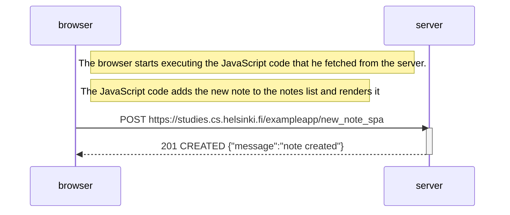

```mermaid
sequenceDiagram
    participant browser
    participant server

    Note right of browser: The browser starts executing the JavaScript code that he fetched from the server.
    Note right of browser: The JavaScript code adds the new note to the notes list and renders it
    browser->>server: POST https://studies.cs.helsinki.fi/exampleapp/new_note_spa
    activate server
    server-->>browser: 201 CREATED {"message":"note created"}
    deactivate server

```
